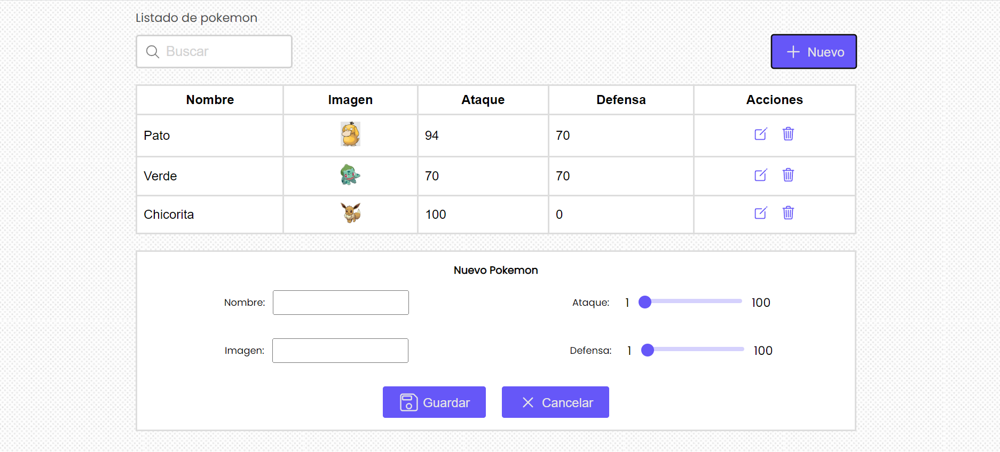
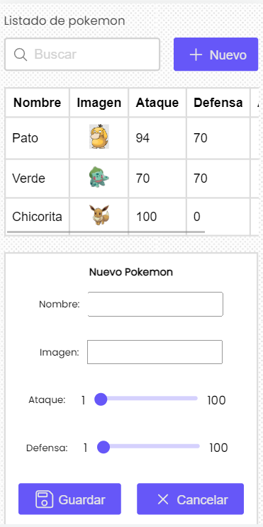

# React Pokemon FrontEnd for API

> This is a responsive CRUD app that connects with an API to preform the API functionalities

## Built With

- React.js
- CSS only
- JEST - React Testing

## Getting Started

### Setup

- Git clone https://github.com/RafaelEchart/React_DevsuChallenge.git

- cd React_DevsuChallenge

### Install

- `npm install`

### Usage

- `npm run start`

### Run tests

- `npm run test`

## Authors

👤 **Rafael Echart**

- GitHub: [@rafaelechart](https://github.com/rafaelechart)
- Twitter: [@rafaechart](https://twitter.com/rafaelechart)

## Show your support

Give a ⭐️ if you like this project!

